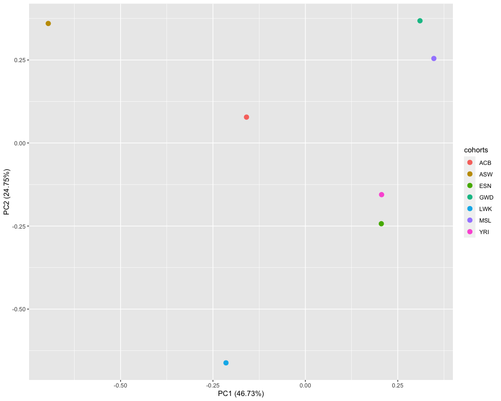

```{r, include = FALSE}
knitr::opts_chunk$set(
  collapse = TRUE,
  comment = "#>"
)
```
```{r, include = FALSE}
colorize <- function(x, color){
    if(knitr::is_latex_output()){
        sprintf("\\textcolor{%s}{%s}", color, x)
    }else if(knitr::is_html_output()){
        htmlcolor = "black"
        if(color == "blue"){
            htmlcolor = "#0000FF"
        }
        if(color == "brown"){
            htmlcolor = "#964B00"
        }
        if(color == "olive"){
            htmlcolor = "#808000"
        }
        if(color == "violet"){
            htmlcolor = "#8601AF"
        }
        if(color == "orange"){
            htmlcolor = "#FF7F00"
        }
        sprintf("<span style='color: %s;'>%s</span>", htmlcolor, x)
    }else x
}
```

# Introduction

**env.MRmega** (Environment-adjusted MR-MEGA) is a package to identify genetic variants that are associated with each trait, across cohorts, while adjusting for differing environmental exposures between cohorts. For the environment-adjusted MR-MEGA approach, we will adapt the original MR-MEGA meta-regression framework to account for environmental exposures that are specific each cohort. Apart from environment-adjusted MR-MEGA methodology, the R package also includes pre-processing of the inputted GWAS files, calculation of axes of genetic variation and the original MR-MEGA methodology.

This vignette introduces the whole meta-analysis procedure using the original MR-MEGA approach and the environment-adjusted MR-MEGA approach.  

# GWAS data format

No matter which meta-analysis methods (environment-adjusted MR-MEGA or MR-MEGA) are applied, a list of GWAS datasets would be the main input as required, and each GWAS data must contain mandatory columns. Details of GWAS format would be given by a simple simulation. 


For convenience of illustration, we would grossly simulate several GWAS datasets containing medium-sized genetic variants and the associated genetic information. In the simulated data, we considered 7 sub-populations of African ancestry which were collected from Phase 3 of the 1000 Genomes Project[@10002015global],see https://ctg.cncr.nl/software/MAGMA/ref_data/. The 7 populations were coded as **ACB**, **ASW**, **ESN**, **GWD**, **LWK**, **MSL**, **YRI**. Among the 7 GWAS raw data, we randomly selected 50 genetic variants across 23 chromosomes to create 7 medium-sized GWAS files. The format of each file has mandatory column headers, shown as `r colorize("MR-MEGA", "blue")` software (https://genomics.ut.ee/en/tools):

 - `MARKERNAME` -  snp name 
 - `N` - sample size
 - `EAF` - effect allele frequency
 - `EA` - effect allele
 - `NEA` - non effect allele
 - `CHROMOSOME` - chromosome of marker
 - `POSITION` - position of marker
 - `BETA` - beta
 - `SE` - std.error

When simulating quantitative traits, in the specified African populations (**ESN**, **GWD**, **LWK**), we consider equal-sized populations (4K in each population). Then we set three genetic variants,`rs201029612`, `rs79862059` and `rs77833422`, which are associated with the quantitative traits. To mimic the real GWAS data in which some genetic variants would not exist in all populations, we made that the two genetic variants, `rs190897515` and `rs577430535`, exist in **ACB** population only; one genetic variant `rs185581532` exists in 5 populations only and one genetic variant `rs572565163` exists in 4 populations only. The details of 7 simulated GWAS data are saved in `afr.gwas` object as a list. 
```{r}
require(env.MRmega)
lapply(afr.gwas,function(x){head(x,2)})
```

In real life, GWAS statistic data of each cohort would be saved as a file (".txt"), even a compressed file (".txt.gz"), containing tens of thousands of genetic variants information. We could create a input file which contains all study files and
use `readInputfile` function to aggregate several GWAS files into a list.
```{r,error=TRUE}
data_name=c("~/Desktop/mr-mega-r/MR_MEGA_ENV_git/g1000_afr_7gwas_git/afr_acb_EGL20.txt",
            "~/Desktop/mr-mega-r/MR_MEGA_ENV_git/g1000_afr_7gwas_git/afr_asw_EGL20.txt",
            "~/Desktop/mr-mega-r/MR_MEGA_ENV_git/g1000_afr_7gwas_git/afr_esn_EGL20.txt",
            "~/Desktop/mr-mega-r/MR_MEGA_ENV_git/g1000_afr_7gwas_git/afr_gwd_EGL20.txt",
            "~/Desktop/mr-mega-r/MR_MEGA_ENV_git/g1000_afr_7gwas_git/afr_lwk_EGL20.txt",
            "~/Desktop/mr-mega-r/MR_MEGA_ENV_git/g1000_afr_7gwas_git/afr_msl_EGL20.txt",
            "~/Desktop/mr-mega-r/MR_MEGA_ENV_git/g1000_afr_7gwas_git/afr_yri_EGL20.txt")

out<-readInputfile(data_name,qt=TRUE)
lapply(out,function(x){head(x,2)})
```
`r colorize("Note", "blue")`: 

- For convenience of simplicity, we do not take account of sex stratification in this case. In real life, each GWAS file can be stratified by sex into male and female cohorts. The 7 GWAS files then would be divided into 14 cohorts, then the environment-adjusted MR-MEGA and the original MR-MEGA approaches can also be used for sex-stratified GWAS data. 

For the environment-adjusted meta-regression analysis, besides the above mentioned mandatory columns in each GWAS study file, we also need to add cohort-specific environmental exposure information. Here we assume a binary environmental exposure, smoking status (1/0). Within each cohort, smoking status=1 for individuals having smoking habits and smoking status=0 for individuals having no smoking habits.

`r colorize("Note", "blue")`: 

- For 14 sex-stratified cohorts, the individual-level data for environment covariates would comprise one binary smoking status and one binary sex indicator (female=1/male=0). With each sex-stratified cohort, sex indicator =1 for all female cohorts and sex indicator =0 for all male cohorts.

# Simulation example
## Packages installation and loading
First, we load the packages necessary for analysis, and check the version of each package.The provided demo runs in less than 2 seconds including preparation and execution of both MR-MEGA/environment-adjusted MR-MEGA procedures.
```{r,eval=FALSE}
#cran
cran.pkgs <- c('data.table', 'doMC', 'doParallel','dplyr','iterators','parallel','R.utils')

# load packages 
sapply(cran.pkgs, require, character.only = TRUE)
```


## Data pre-processing 

**Calculate PCs**

Before fitting the environment-adjusted meta-regression model and the original meta-regression model [@magi2017trans], we need to specify the number of PCs (`r colorize("T", "blue")`), default=2. Specifically, we used a subset of genetic variants with MAF>5\% in all population files to derive Euclidean distances matrix. Then the two axes of genetic variation were derived from the multi-dimensional scaling of the distance matrix in the corresponding reference panel. 
Figure 1 shows that the first two axes of genetic variation from multi-dimensional scaling of the Euclidean distance matrix between 7 populations are sufficient to separate population groups from different regions of Africa. 

```{r,out.width='100%',fig.align='center',fig.cap="Figure 1. Axes of genetic variation separating seven populations from African ancestry"}



```

`r colorize("Note", "blue")`: the number of axes of genetic variation and the number of environmental covariates would depend on the diversity of cohorts, but the limitation of the number of axes of genetic variation (`r colorize("T", "blue")`) and the number of environmental covariates (`r colorize("S", "blue")`) should be less than the number of cohorts (`r colorize("K", "blue")`) - 2. 

The function used for calculating PCs would be built in the function `MR_mega_prep` which is used for preparing inputted data in the environment-adjusted meta-regression and the original meta-regression models. For convenience of PC calculation independently, we extracted the function used for calculating PCs  `MR_mega_MDS` out. Since the simulated GWAS data contain 50 genetic variants only, we would derive PCs from the subset of genetic variants with MAF>5\% in the whole of the 7 GWAS raw files, each file consisting of thousands of genetic variants across 23 chromosomes.

For running `MR_mega_MDS` function, you can create a vector containing all population file names and the corresponding locations. Then you need to point out the location of the output, named by `batch_loc`.

`r colorize("Note", "blue")`: The data are pre-loaded and these lines should not be run in the demo.
```{r,eval=FALSE}
data_name=c("~/MR_MEGA/MR_MEGA_ENV_gitdta/g1000_afr_acb/g1000_afr_acb.inf",
            "~/MR_MEGA/MR_MEGA_ENV_gitdta/g1000_afr_asw/g1000_afr_asw.inf",
            "~/MR_MEGA/MR_MEGA_ENV_gitdta/g1000_afr_esn/g1000_afr_esn.inf",
            "~/MR_MEGA/MR_MEGA_ENV_gitdta/g1000_afr_gwd/g1000_afr_gwd.inf",
            "~/MR_MEGA/MR_MEGA_ENV_gitdta/g1000_afr_lwk/g1000_afr_lwk.inf",
            "~/MR_MEGA/MR_MEGA_ENV_gitdta/g1000_afr_msl/g1000_afr_msl.inf",
            "~/MR_MEGA/MR_MEGA_ENV_gitdta/g1000_afr_yri/g1000_afr_yri.inf")
batch_loc="~/MR_MEGA/MR_MEGA_ENV_gitdta/"
MR_mega_MDS(data_name,batch_loc,qt=TRUE,pcCount=2,ncores=10)
```
In the above command, `MR_mega_MDS` function would output two files, one file containing axes of genetic variants and another containing multi-dimensional scaling (MDS) of Euclidean distances matrix. After inputting 7 GWAS files, we get the PCs shown as follows.
```{r}
pcs
```

**Categorize BETA, SE and other genetic variant information into different objects**

Based on the 7 simulated GWAS files, we categorized `BETA` and `SE` into two objects which would be saved as a list via `MR_mega_prep` function. 


`r colorize("Note", "blue")`: 

- It is required that the order of names of `afr.gwas` should always be consistent with the order of `data_name` as input in `MR_mega_MDS` function. 

-  Considering GWAS files might contain thousands of genetic variants in real life, we can also divide `BETA` object and `SE` object into several batches. When conducting the environment-adjusted MR-MEGA approach and the original MR-MEGA approach, we could input these batches into the associated functions and performing them in parallel.

```{r}
################env_adjusted MR-MEGA#####################
tictoc::tic("Preparation for performing MR-MEGA/env-MR-MEGA approach")
gwas_input<-MR_mega_prep(sum_stat_pop=afr.gwas,n_cohort=7,usefor="env-mr-mega",qt=TRUE,pcCount=2,calpc=FALSE,envCount=1,ncores=2)
tictoc::toc()
names(gwas_input)

head(gwas_input$beta_pop,2)
head(gwas_input$invse2_pop,2)
head(gwas_input$marker_inf_pop,2)
head(gwas_input$cohort_count_filt,2)
gwas_input$sel_gene
################MR-MEGA#####################
gwas_input<-MR_mega_prep(sum_stat_pop=afr.gwas,n_cohort=7,usefor="mr-mega",qt=TRUE,pcCount=2,calpc=FALSE,ncores=2)
gwas_input$sel_gene

```
In `MR_mega_prep` function, the arguments are described in details here:

- `sum_stat_pop` is a list of all GWAS file data which would be inputted in the environment-adjuste meta-regression model or the original meta-regression model.

- `n_cohort` refers to the number of cohorts.

- `usefor` is the option of meta analysis methods which can be "mr-mega" or "env-mr-mega". If the option is "mr-mega", the limitation of the number of axes of genetic variation (`r colorize("T", "blue")`) should be `r colorize("T<K-2", "blue")`. If the option is "env-mr-mega", the limitation of the number of axes of genetic variation (`r colorize("T", "blue")`) and the number of environmental covariates (`r colorize("S", "blue")`) should be `r colorize("T+S<K-2", "blue")`.

- `qt` is logical vector of length 1, which means whether the trait is quantitative (TRUE) or not (FALSE). The current package is only applied for quantitative traits. Default is TRUE.

- `pcCount` is the number of axes of genetic variation (`r colorize("T", "blue")`).

- `calpc` is logical vector of length 1, which means whether need to calculate PCs. If PCs have been obtained, `calpc=FALSE`.

- `envCount` is the number of environmental covariates (`r colorize("S", "blue")`).

In the procedure of pre-processing the GWAS data, we will filter out the genetic variants of which the frequencies less than `pcCount`+2 for 'mr-mega' and `pcCount+envCount`+2 for 'env-mr-mega'. These genetic variants will not be inputted into the analysis of meta-regression models and saved as `sel_gene` object in the output of `MR_mega_prep` function. As **GWAS data format** section mentioned, the frequencies of the four genetic variants (`rs190897515`, `rs577430535`,`rs185581532`,`rs572565163`) existing across the 7 populations are 1,1,5,4. For `usefor="mr-mega"`, meta-analysis would exclude three genetic variants (`rs190897515`, `rs577430535`,`rs572565163`) due to `r colorize("T<K-2", "blue")`. For `usefor="env-mr-mega"`, meta-analysis would exclude three genetic variants (`rs190897515`, `rs577430535`,`rs185581532,`rs572565163`) due to `r colorize("T+S<K-2", "blue")`.


In addition to `sel_gene` object, the output of `MR_mega_prep` function contain other objects: BETA values (`BETA`), the inverse of variance (`invse2_pop`), the information of each genetic variant (`marker_inf_pop`), the frequencies of remained genetic variants across the 7 cohorts (`cohort_count_filt`). If `calpc=TRUE`, axes of genetic variation would be calculated based on the inputted `sum_stat_pop` and the resulting output would contain `pcs` object.

In this simulation, we have calculated 2 PCs which would be used in the original meta-regression model and environment-adjusted meta-regression model. Besides, for environment-adjusted meta-regression model accounting for environmental exposures varied between cohorts, we introduce individual-level smoking status as a environmental covariate. For each environmental covariate measured in all cohorts, we construct a cohort-level environmental covariate by taking the mean or proportion of each covariate within each cohort. Here we give the smoking proportions across the 7 populations.
```{r}
head(smoke.env)
smoke.env=unlist(lapply(smoke.env,function(x){round(mean(x),4)}))
smoke.env
```

To prepare performing meta-analysis by the original MR-MEGA approach (`MR_mega_lrw`) and the environment-adjusted MR-MEGA approach (`MR_mega_env_lrw`), we need to add axes of genetic variants (PCs) into `gwas_input` object. Especially for the environment-adjusted MR-MEGA approach, cohort-level environmental covariates would be added into `gwas_input` object as well. If we set 'calpc=TRUE' in `MR_mega_prep` function, the resulting output of `MR_mega_prep` function would comprise `pcs` object. 

```{r}
gwas_input$pcs=pcs;
gwas_input$env=unlist(lapply(smoke.env,function(x){round(mean(x),4)}))
```

`r colorize("Note", "blue")`: 

- For 14 sex-stratified cohorts, `gwas_input$env` would be shown as a dataframe, consisting of a vector for smoking proportions across cohorts and a vector for sex (female cohorts=1/male cohorts=0). 

## GWAS data analysis

After constructing a list of the inputted GWAS data `gwas_input` obtained from `MR_mega_prep` function, we then use `MR_mega_lrw` function and `MR_mega_env_lrw` function to perform meta analysis respectively. 

`r colorize("Note", "blue")`: In the original meta-regression model, it is not required that `gwas_input` must contain `env` object.

**MR-mega** 

```{r,error=TRUE}
names(gwas_input)
tictoc::tic("Perform MR-MEGA approach")
out=MR_mega_lrw(gwas_input,qt=TRUE,ncores=2,pcCount=2)
tictoc::toc()
head(out,4)
```

For the original MR-MEGA approach, results contain following columns:

- `MARKERNAME`: unique marker identification across all cohorts.

- `CHROMOSOME`: chrmosome of marker.

- `POSITION`: physical position in chromosome of marker.

- `EA`: effective allele.

- `NEA`: non-effective allele.

- `N`: sample size.

- `EAF_avg`: the weighted EAF.

- `dir`: the direction of allelic effects (BETA) across all cohorts. In the cohort, the allelic effect is is denoted as follows: "+", if>0; "-", if </=0; NA, if missing.

- `beta0`: effect of the intercept of meta-regression.

- `se0`: stderr of the effect of the intercept of meta-regression.

- `beta{i}`: effect of the i-th PC of meta-regression.

- `se{i}`: stderr of the effect of the i-th PC of meta-regression.

- `chisq_association`, `ndf_association` and `pvalue_association`: test of the null hypothesis of no association of each variant. `chisq_`, `ndf_` and `pvalue_` refer to chisq value, number of degrees of freedom and p-values of the corresponding test.

- `chisq_heter`, `ndf_heter` and `pvalue_heter`: test of heterogeneity in allelic effects. For the orignial MR-MEGA approach, it is assumed that  the heterogeneity in allelic effects might be correlated with the ancestral effect only.

- `chisq_residual`, `ndf_residual` and `pvalue_residual`: test of residual heterogeneity.

- `Count_cohorts`: the frequencies of genetic variants present in all cohorts.

**Environment-adjusted MR-mega**

```{r,error=TRUE}
tictoc::tic("Perform env-MR-MEGA approach")
out.env=MR_mega_env_lrw(gwas_input,qt=TRUE,ncores=2,pcCount=2)
tictoc::toc()
head(out.env,4)
```
For the environment-adjusted MR-MEGA approach, results contain tests which are different from that in the original MR-MEGA approach. Details are shown as follows:

- `chisq_heter`, `ndf_heter` and `pvalue_heter`: test of heterogeneity in allelic and environmental effects.

- `chisq_env`, `ndf_env` and `pvalue_env`: test of heterogeneity in the environmental effect only.

- `chisq_PC`, `ndf_PC` and `pvalue_PC`: test of heterogeneity in the allelic effect only.

# Reference

